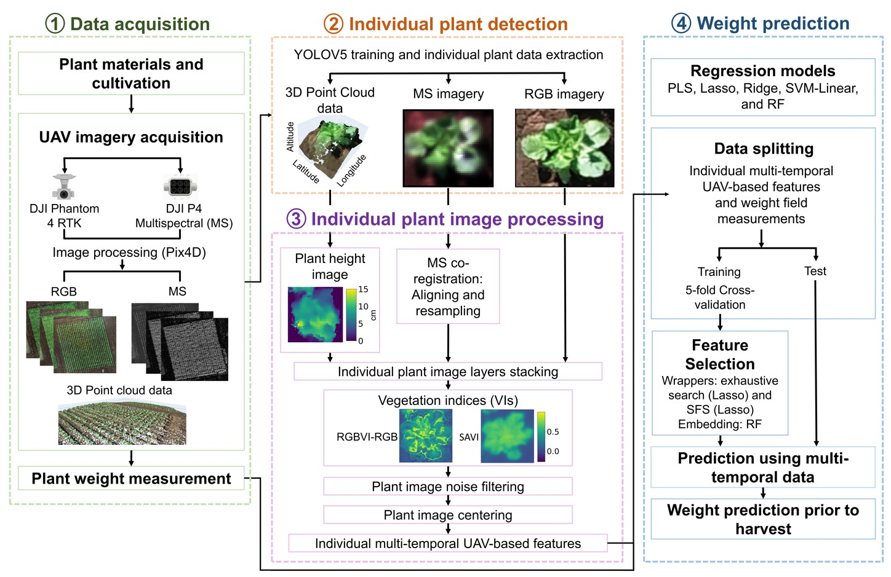

## UAV data extraction for crop phenotyping

This repository contains the code necessary to reproduce the analysis presented in the paper titled 'Individual Chinese cabbage weight prediction using multi-temporal unmanned aerial vehicle-based data'. 

The repository focuses on three key topics:

- Individual plant detection
- Individual plant image processing
- Weight prediction

### Usage

We provide google colabs to facilitate the understanding and implementation of the methods described in the paper The notebooks include detailed explanations, code snippets, and example data to guide you through the process.

To get started, please refer to the following notebooks:

